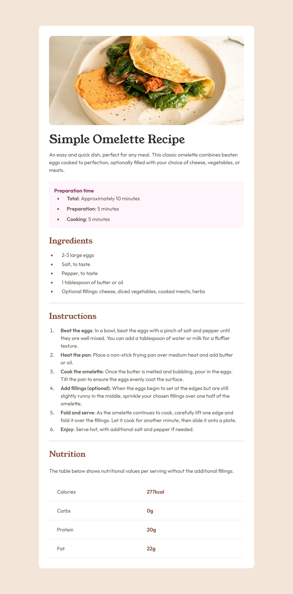

# Frontend Mentor - Recipe page solution

This is a solution to the [Recipe page challenge on Frontend Mentor](https://www.frontendmentor.io/challenges/recipe-page-KiTsR8QQKm). Frontend Mentor challenges help you improve your coding skills by building realistic projects.

## Table of contents

- [Frontend Mentor - Recipe page solution](#frontend-mentor---recipe-page-solution)
  - [Table of contents](#table-of-contents)
  - [Overview](#overview)
    - [Screenshot](#screenshot)
    - [Links](#links)
  - [My process](#my-process)
    - [Built with](#built-with)
    - [Useful resources](#useful-resources)
  - [Author](#author)

**Note: Delete this note and update the table of contents based on what sections you keep.**

## Overview

### Screenshot

### Links

- Solution URL: [Add solution URL here](https://your-solution-url.com)
- Live Site URL: [Add live site URL here](https://your-live-site-url.com)

## My process

### Built with

- Semantic HTML5 markup
- TailwindCSS
- Flexbox
- CSS Grid
- Mobile-first workflow

### Useful resources

- [TailwindCSS Docs](https://tailwindcss.com/) - The TailwindCSS docs are always helpful whenever I need to quickly look up something.

## Author

- Website - [jccdev](https://jccdev.vercel.app)
- Frontend Mentor - [@jccdev45](https://www.frontendmentor.io/profile/jccdev45)
- Twitter - [@jccdev](https://www.twitter.com/jccdev)
